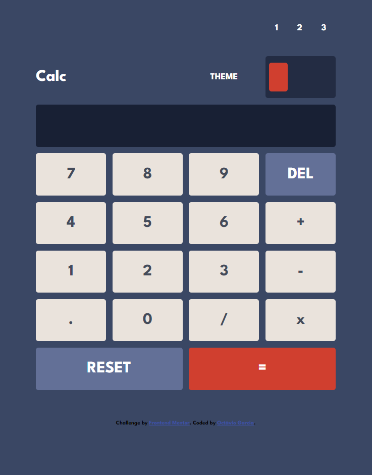

# Frontend Mentor - Calculator app

## Description
Project made in HTML, CSS and JavaScript as a challenge in Front-End Mentor.

## Functionalities
It is a calculator and you can make the following operations. /, *, - and +.

## How to use
Just click on the number, select the operation, select another number and check the result in “=”.

## Contact
Any doubts or questions reach me at octaviogarcia1988@gmail.com

## Author
Octávio Garcia

